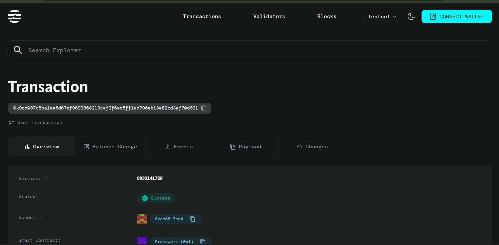

# NFT Lottery Contract

## Project Description

A decentralized NFT lottery system built on the Aptos blockchain that allows users to participate in lottery drawings where winners receive random NFTs. Participants purchase lottery tickets using AptosCoin, and winners are selected to receive unique NFTs from a predefined collection. This creates an engaging and fair way to distribute NFTs while building community participation.

## Project Vision

Our vision is to revolutionize NFT distribution by creating transparent, fair, and engaging lottery systems that democratize access to valuable digital assets. We aim to build a platform where creators can efficiently distribute their NFT collections while providing equal opportunities for all participants to win rare and unique digital collectibles.

## Key Features

- **Decentralized Lottery System**: Fully on-chain lottery mechanism ensuring transparency and fairness
- **NFT Prize Pool**: Winners receive random NFTs from a curated collection
- **Ticket Purchase System**: Simple and secure ticket purchasing using AptosCoin
- **Automated Fund Collection**: Seamless collection and management of lottery funds
- **Owner Controls**: Lottery creators can manage their lottery parameters
- **Participant Tracking**: Comprehensive tracking of all lottery participants
- **Fair Random Selection**: Transparent winner selection process
- **Multi-NFT Support**: Support for multiple NFTs in a single lottery

## Future Scope

- **Advanced Randomness**: Integration with Aptos randomness API for provably fair winner selection
- **Multiple Prize Tiers**: Implementation of first, second, and third prize categories
- **Scheduled Drawings**: Automated lottery drawings at predetermined times
- **Cross-Chain Compatibility**: Expansion to other blockchain networks
- **NFT Marketplace Integration**: Direct integration with popular NFT marketplaces
- **Governance Token**: Introduction of governance tokens for platform decision-making
- **Mobile Application**: Development of user-friendly mobile interface
- **Analytics Dashboard**: Comprehensive analytics for lottery performance and user engagement
- **Staking Mechanisms**: Staking features for enhanced rewards and platform loyalty
- **Social Features**: Community features like participant chat and winner showcases

## Contract Details

0x9dd087c8ba1ea5d67ef9692368213cef2f6ed5ff1ad796eb13e80cd3af70d021
